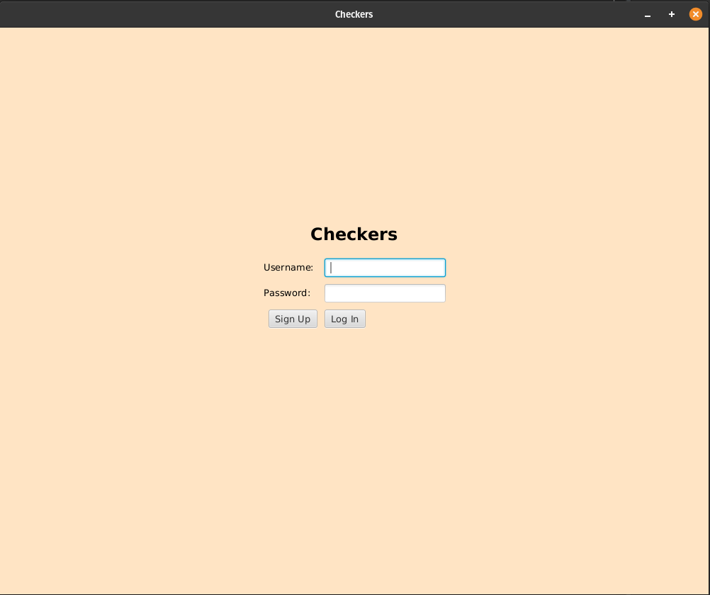
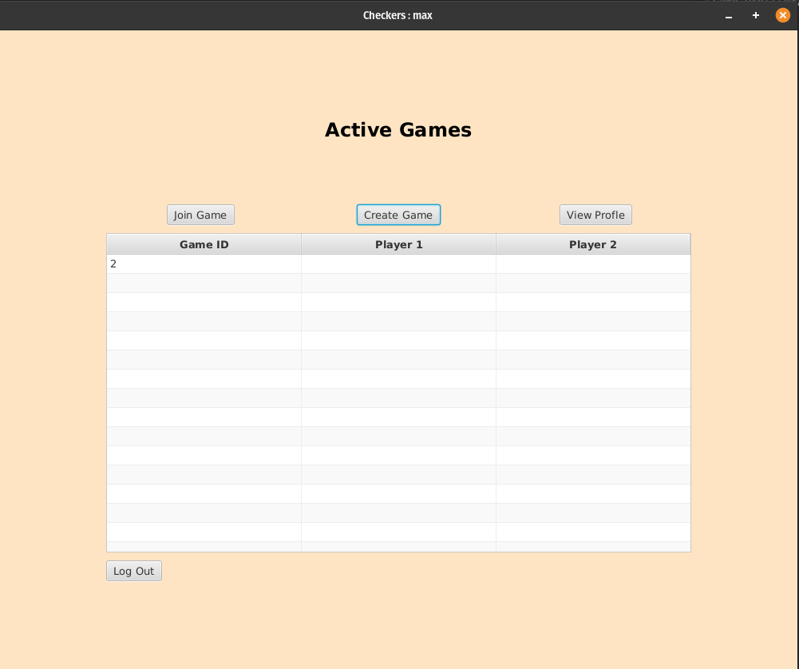
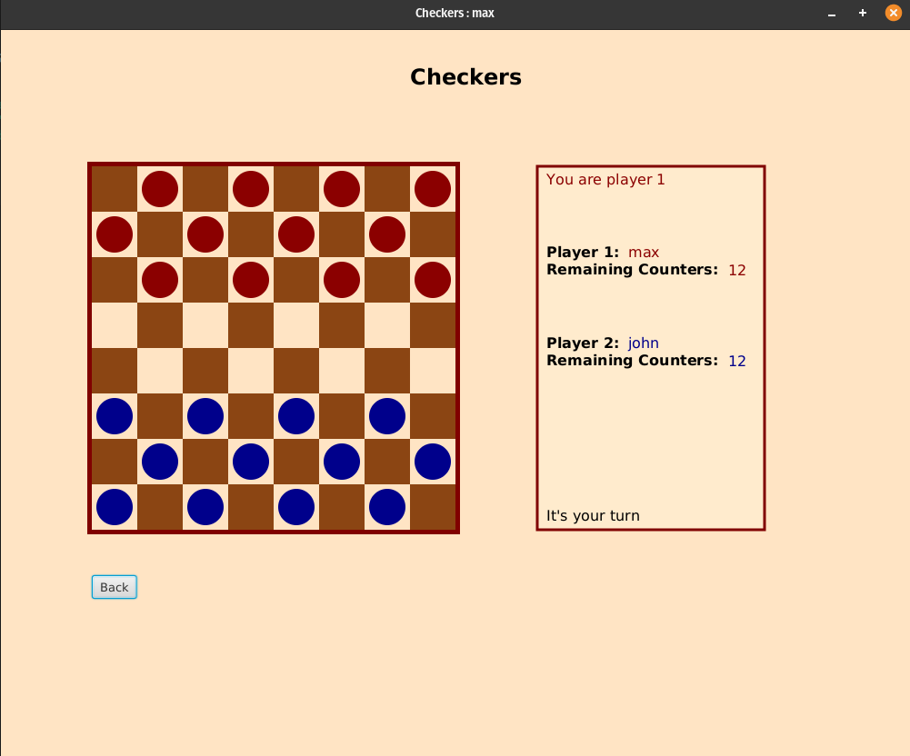

# Checkers

**A Server-Client Java game**

### Components

- Server-Client networking
- Database queries in PostgreSQL
- GUI written in JavaFX
- Game logic in Java

### How to Run

- Initialise PostgreSQL database using **Checkers.sql**
- Input PostgreSQL user details into **DatabaseConnect.java**
- Run **Server** on host system
- If running client on host system, run **GUIMain.** Otherwise edit **Client.java** *hostIP* to the host's IP address using the template given
- For more players, run more instances of **GUIMain**

### Challenges

- Creating a logical Server-Client communication protocol
- Designing a GUI which is visually appealing and easy to use
- Completing database query calls from GUI
- Writing game logic which covers all game scenarios

### Future Changes

- Added TCP/UDP networking
- Improve GUI design using FXML
- Improve Server-Client communication efficiency

### Screenshots

